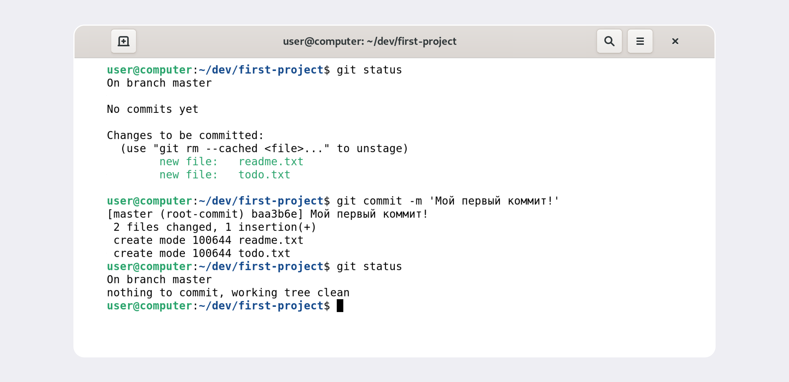

<div style="text-align:center">

# Знакомство с GIT.
</div>

## Установка.

Для начала нам нужно скачать и установиться непосредственно сам GIT Bash для работы с GIT. Скачивать будем с данного сайта https://git-scm.com/download/win он установит не только GIT Bash, но и сам GIT.

Проверьте, что в списке устанавливаемых программ стоит галочка напротив пункта Git Bash Here 
— это позволит открывать консоль с Git в любой папке.

<div style="text-align:center">

</div>

После того как мы скачали и установили GIT Bash нам нужно его запустить. Если вдруг на рабочем столе ярлык приложения не появился, то его можно открыть через директорию (папку). Обычно он расположен в C:\Program Files\Git\bin. 

При открытии приложения должно появиться подобное окно.

<div style="text-align:center">

</div>

Вместо USER_NAME будет указано ваше имя пользователя, а вместо HOST_NAME — имя компьютера. Тильда (~) говорит нам о том, что мы находимся в домашней директории, на Windows это C/Users/папка_с_вашем_именем .

<br/>
<div style="text-align:center">

# Команды необходимые для работы с коммандной строкой
</div>

## Навигация

- `pwd` (от англ. _**p**rint **w**orking **d**irectory_, «показать рабочую папку») - покажи, в какой я папке;

- `ls` (от англ. _**l**ist **d**irectory contents_, «отобразить содержимое директории») — покажи файлы и папки в текущей папке;

- `ls -a` — покажи также скрытые файлы и папки, названия которых начинаются с символа .;

- `cd first-project` (от англ. _**c**hange **d**irectory_, «сменить директорию») — перейди в папку first-project;

- `cd first-project/html` — перейди в папку html, которая находится в папке first-project;

- `cd ..` — перейди на уровень выше, в родительскую папку;

- `cd ~` — перейди в домашнюю директорию (/Users/Username);

- `cd /` — перейди в корневую директорию.

## Работа с файлами и папками

Создание

- `touch index.html` (англ. _touch_, «коснуться») — создай файл `index.html` в текущей папке;

- `touch index.html style.css script.js` — если нужно создать сразу несколько файлов, можно напечатать их имена в одну строку через пробел;

- `mkdir second-project` (от англ. _**m**a**k**e **dir**ectory_, «создать директорию») — создай папку с именем `second-project` в текущей папке.

<br/>Копирование и перемещение

- `cp file.txt ~/my-dir` (от англ. _**c**o**p**y_, «копировать») — скопируй файл в другое место;

- `mv file.txt ~/my-dir` (от англ. _**m**o**v**e_, «переместить») — перемести файл или папку в другое место.

<br/>Чтение

- `cat file.txt` (от англ. _con**cat**enate and print_, «объединить и распечатать») — распечатай содержимое текстового файла `file.txt`.

<br/>Удаление

- `rm about.html` (от англ. _**r**e**m**ove_, «удалить») — удали файл `about.html`;

- `rmdir images` (от англ. _**r**e**m**ove **dir**ectory_, «удалить директорию») — удали папку `images`;

- `rm -r second-project` (от англ. _**r**e**m**ove_, «удалить» + _**r**ecursive_, «рекурсивный») — удали папку second-project и всё, что она содержит.


## Лайфкахи

- Команды необязательно печатать и выполнять по очереди. Можно указать их списком — разделить двумя амперсандами (`&&`).

- У консоли есть собственная память — буфер с несколькими последними командами. По ним можно перемещаться с помощью клавиш со стрелками вверх (`↑`) и вниз (`↓`).

- Чтобы не вводить название файла или папки полностью, можно набрать первые символы имени и дважды нажать `Tab`. Если файл или папка есть в текущей директории, командная строка допишет путь сама. <p> Например, вы находитесь в папке `dev`. Начните вводить `cd first` и дважды нажмите `Tab`. Если папка `first-project` есть внутри `dev`, командная строка автоматически подставит её имя. Останется только нажать `Enter`.</p>

<br/>
<div style="text-align:center">

# Непосредственно сам GIT
</div>

До этого мы "учились" пользоваться коммандной строкой для _перемещения_ и _манипуляции с файлами_, чтобы можно было работать с файлами, теперь же начнём "изучение" GIT. 

Git — это система контроля версий, которая помогает отслеживать изменения в проекте. Этот инструмент можно использовать как для индивидуальной, так и для командной работы.

Git позволяет сохранять изменения локально и при необходимости возвращаться к предыдущим версиям проекта. Также можно создать удалённую копию на хостинг-платформе, которая работает с Git, и поделиться результатом с другими.

## Инициализация репозитория

Чтобы Git начал отслеживать изменения в проекте, папку с файлами этого проекта нужно сделать **Git-репозиторием** (от англ. _repository_ — «хранилище»). Для этого следует переместиться в неё и ввести команду `git init` (от англ. initialize — «инициализировать»).

Для начала нам нужно создать _**любую папку**_ в _**любом месте**_, которая и будет нашем репозиторием, затем нам нужно перейти в неё используя команды описаные выше, в данном случае `cd`. Да, всё это уже необходимо делать через GIT Bash. 

Пример используемых команд для перехода в папку first-project и деланьем её репозиторием.

```
$ cd ~/dev/first-project
   
$ git init
```

**Важно! Репозиторий может быть только один.**

Если вы случайно сделали Git-репозиторием не ту папку, её можно «разгитить». Для этого нужно удалить скрытую подпапку `.git`

    $ cd <папка с репозиторием> # перешли в папку

    $ rm -rf .git # удалили подпапку .git

Разберём подробнее, что такое -rf:

- ключ `-r` (от англ. _**r**ecursive_ — «рекурсивно») позволяет удалять папки вместе с их содержимым;

- ключ `-f` (от англ. _**f**orce_ — «заставить») избавит вас от вопросов вроде «Вы точно хотите удалить этот файл? А этот? И этот тоже?».

**Примечание!** Если удалить `.git`, то вся история проекта будет стёрта без возможности восстановления — останется только последняя версия файлов.

## Проверить состояние репозитория — `git status`

12После инициализации репозитория `first-project` запустите команду `git status` (от англ. _status_ — «статус», «состояние») — она показывает текущее состояние репозитория.

<div style="text-align:center">

</div>

<br/>Команда `git status` выведет:

- название текущей ветки: On `branch master` или On `branch main`;

- сообщение о том, что в репозитории ещё нет коммитов: `No commits yet`;

- сообщение, которое говорит: «чтобы что-нибудь закоммитить (то есть зафиксировать), нужно сначала это создать» — `nothing to commit (create/copy files and use "git add" to track)`.
 
## Добавляем файлы в репозиторий. Шаг 1. GIT ADD.

Что бы добавить файлы в репозиторий нам понадобятся несколько команд, первая из них это `git add`.

Добавим в репозиторий два файла. Например, файл `todo.txt`, в котором будет список дел, и `readme.txt` для информации о проекте. Затем напишем `git status` чтобы посмотреть что изменилось.

    $ touch todo.txt
    $ touch readme.txt

    $ git status

Git сообщит, что в папке `first-project` есть `untracked files` (от англ. track — «следить», untracked — «неотслеженный», «неотслеживаемый») — ещё не отслеживаемые файлы `readme.txt` и `todo.txt`.

Так как мы добавили два файла и мы хотим отслеживать состояние обоих, поэтому можем использовать команду `git add --all` (от англ. _**add**_ — «добавить» + от англ. _all_ — «всё»). Ключ, или флаг, `--all` позволяет подготовить к сохранению все файлы в репозитории.

    $ git add --all
    $ git status

Добавлять файлы можно и по одному, без ключа `--all`.

    $ git add todo.txt
    $ git add readme.txt
    $ git status 

Также можно добавить текущую папку целиком — в этом случае все файлы в ней тоже будут добавлены. Обратиться к текущей папке в Bash позволяет точка (`.`).

    $ git add . # добавить всю текущую папку
    $ git status

Вы можете использовать любой из этих вариантов — результат будет одинаковый...

<div style="text-align:center">

</div>

Файлы, которые были отмечены красным, **не отслеживались**, а когда они стали зелёными это означает, что теперь мы их **отслеживаем**, но ещё **не сохраняем**. Для этого нам понадобится следующая команда.

[?] Чтобы **отменить** `git add` для какого-то контрентного файла можно воспользоваться командой ` git restore --staged <file>`

[?] Сделать откат файла если случайно его изменили, но не хотели - `git restore <file>`

Если сейчас отредактировать любой из зелёных файлов и снова ввести команду `git status`, то он перейдёт в состояние `modified` и будет находить находится и в "зелёном" и в "красном" списках. И если на данном этапе **сохранить** изменённый файл, то он сохраниться в том состоянии в котором было до изменения (когда был только в "зелёном" списке). Чтобы **сохранить** его с изменениями нам нужно снова прописать `git add --all`, чтобы он был только в "зелёном" списке. Но это ещё не сохранение, а только наблюдение, это как перестановка людей для общего фото, людей поменяли, но ещё не сфотографировали (сохранили).

## Делаем первый коммит. Шаг 2. GIT COMMIT.

Итак, чтобы **сохранить** файл нам понадобиться команда `git commit` с ключом `-m` (от англ. _**m**essage_ — «сообщение»), который присваивает коммиту сообщение.

Ключ `-m` позволяет нам сделать заметку какое именно было изменение, это как комментарий в программировании. Коментарий пишется после ключа в одинарных ковычках. Пример.

    $ git commit -m 'Мой первый коммит!'

После нажатия `Enter` текущая версия файлов будет сохранена в репозитории с сообщением `Мой первый коммит!`. **Коммит** (по названию команды `git commit`) — это по сути список файлов с их контентом.

<div style="text-align:center">

</div>

<br/>Итак, подитожим. Сначала мы редактируем файл, затем пишем команду `git add --all`, и только в конце `git commit -m '...'`.

Если мы хотим добавить какие-либо файлы в последний коммит не создавая при этом новый коммит, то используем команду `git commit --amend --no-edit`, перед этим написав `git add` для этих же файлов.

Если мы хотим изменить сообщение последнего коммита, то используем команду `git commit --amend -m "Новое сообщение"`. **Флаг** `--amend` работает только с последним коммитом (`HEAD`).

Чтобы сделать "откат" к определённому коммиту исопльзуем команду `git reset --hard <commit hash>`, где `commit hash` - хеш коммита к которому мы хотим вернуться. Можно так же писать и не хеш коммита, а на сколько комитов мы хотим "откатиться" `git reset --hard~n`, где `n` на сколько шагов вернуться (1 минимальный откат).

**ВНИМАНИЕ! ВСЕ коммиты**, которые были после того к которому мы возвращаемся, **удалятся**.

## Просматриваем историю коммитов

После того как мы сделаем несколько коммитов не плохо было бы и посмотреть их историю. Это можно сделать при помощи команды `git log` (от англ. _log_ — «журнал [записей]»).

<div style="text-align:center">

</div>

Обратите внимание, что по умолчанию `git log` выводит коммиты в обратном хронологическом порядке — последние коммиты оказываются первыми сверху. В этом можно убедиться, если посмотреть на дату и время их создания.

<div style="text-align:center">

# GIT HUB
</div>


<div>

### Как это записано:
<div>```mermaid
    <br>flowchart TD;
    <br>A[ты решил отдохнуть] --> B{Проверь, всё ли ты сделал?};
    <br>B -- Да --> D[Отдыхай];
    <br>B -- Нет --> C[Доделай дела];
    <br>C --> D[Отдыхай];
<br>```
</div>
</div>


## Тут пока ничего нет, но возможно в скором времени что-нибудь да появится. А пока можете самостоятельно изучить что такое GitHub, как создать удалённый репозиторий и для чего всё это нужно.